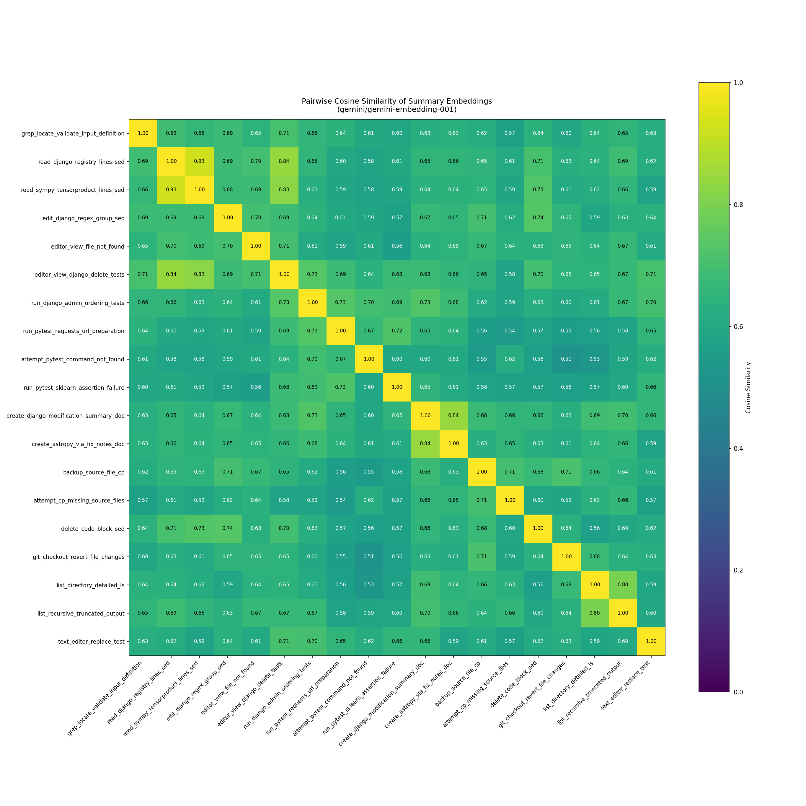

# Summarization Quality Test

This example validates that Hodoscope's summarization step actually improves embedding quality. The idea: raw agent actions contain a lot of task-specific noise (file paths, code snippets, error messages) that can obscure the underlying behavior. Summarization should strip that noise so that semantically similar actions (e.g., two different `grep` searches) end up closer in embedding space, while genuinely different actions (e.g., `grep` vs. `run tests`) stay far apart.

## How it works

`examples.json` contains hand-picked action/feedback pairs covering common agent behaviors: grep searches, file reads, code edits, test runs, directory listings, etc. Some pairs are intentionally similar (e.g., two file reads on different repositories) and some are clearly different (e.g., running tests vs. backing up a file).

`run.py` processes each example through the real Hodoscope pipeline (parse turns, extract actions, summarize, embed) and produces:

1. A **cosine similarity heatmap** (`cosine_similarity.png`) showing pairwise similarity between all action embeddings
2. A **results JSON** with summaries and similarity matrix

## Usage

```bash
# With the default summarization model
python examples/test_summary/run.py

# With a specific model
python examples/test_summary/run.py --model gemini/gemini-2.0-flash

# Skip summarization (embed raw actions directly) as a baseline
python examples/test_summary/run.py --model no_summary
```

You should be able to see clear block-wise patterns after a proper summarization step. We attach the heatmap we generated with the default summarization settings below.

